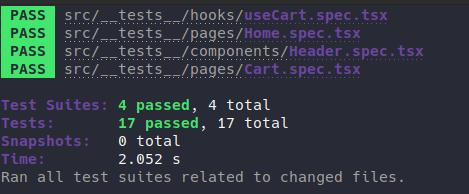

	

	<h1>Custom hooks and Context API</h1>

### Summary

- [About the challenge](#about-the-challenge)

- [Tests](#Tests)

### About the challenge

- An e-commerce application for shopping shoes. [Click here](https://github.com/felipejsborges/ignite-2th-challenge-reactjs-main/commit/b8516e8d00823b5eff2c253e24d070deb18b0eb2) to see the implementation.

### Tests

- **`should be able to render the amount of products added to cart`**

- **`should be able to render each product quantity added to cart`**

- **`should be able to add a product to cart`**

- **`should be able to increase/decrease a product amount`**

- **`should not be able to decrease a product amount when value is 1`**

- **`should be able to remove a product`**

- **`should be able to initialize cart with localStorage value`**

- **`should be able to add a new product`**

- **`should not be able add a product that does not exist`**

- **`should be able to increase a product amount when adding a product that already exists on cart`**

- **`should not be able to increase a product amount when running out of stock`**

- **`should be able to remove a product`**

- **`should not be able to remove a product that does not exist`**

- **`should be able to update a product amount`**

- **`should not be able to update a product that does not exist`**

- **`should not be able to update a product amount when running out of stock`**

- **`should not be able to update a product amount to a value smaller than 1`**
 

	
	

by Felipe Borges 
[LinkedIn](https://www.linkedin.com/in/felipejsborges) | [GitHub](https://github.com/felipejsborges)
